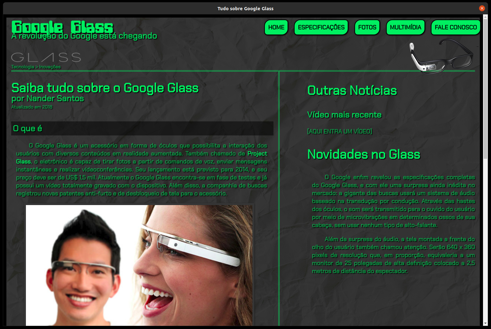

# My-GoogleGlass
This repository contains my first project developed using web development technologies such as HTML, CSS and Javascript. Initially, this project was done following the youtube programming course of "Curso em Vídeo", however, eventually I took the opportunity to test my first project with Electron and transformed the site into a desktop application.

## Install

To test this code, make a clone of this repository and then install it using:

> git clone https://github.com/NanderSantos/My-GoogleGlass.git

> cd My-GoogleGlass

> npm install

Or just run this one-liner command and everything will be done:

> git clone https://github.com/NanderSantos/My-GoogleGlass.git && cd My-GoogleGlass && npm install

## Run

To run this project simply do:

> npm start

## Image

  

